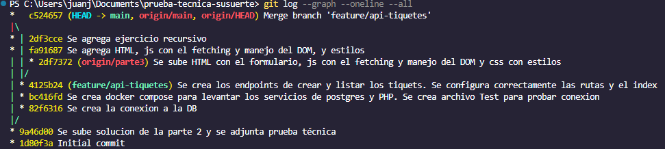

# Prueba Técnica Susuerte

## Descripción

Solución desarrollada para la prueba técnica de Susuerte.

El proyecto incluye:

* Parte 1: Recursividad en PHP.
* Parte 2: Modelado, consultas e inserción SQL en PostgreSQL.
* Parte 3: API REST para laa gestión de tiquetes.
* Parte 4: Interfaz web utilizando HTML, CSS y JavaScript.
* Parte 5: Uso de Git con ramas y commits incrementales.
* Parte 6: Propuesta de mejora.

---

## Tecnologías utilizadas

* PHP 8.3
* PostgreSQL 17
* Docker
* Docker Compose
* JavaScript Vanilla
* HTML5
* CSS3

---

## Requisitos

* Docker Desktop
* Git

Verificar instalación:

docker --version
docker compose version
git --version

---

## Clonar el proyecto

git clone <https://github.com/jugilodev/prueba-tecnica-susuerte.git>
cd prueba-tecnica-susuerte

---

## Configuración

Crear el archivo `.env` en la raíz del proyecto:

DB_HOST=postgres
DB_PORT=5432
DB_NAME=susuerte
DB_USER=postgres
DB_PASSWORD=postgres

---

## Levantar los servicios

Construir e iniciar los contenedores:

    docker compose up -d --build

Verificar que los servicios estén activos:

    docker compose ps

---

## Verificar esquema de base de datos

Conectarse a PostgreSQL:

docker compose exec postgres psql -U postgres -d susuerte

Ejecutar el comando:

\dt

debe de aparecer:

List of relations
 Schema |   Name   | Type  |  Owner
--------+----------+-------+----------
 public | tiquetes | table | postgres
 public | usuarios | table | postgres
(2 rows)

También es posible ejecutarlos desde DBeaver.

Verificar que se hizo correctamente el insert con el siguiente comando:

SELECT * FROM usuarios;

Debe aparecer 4 filas

SELECT * FROM tiquetes;

Debe aparecer 2 filas.

Para salir de la consola del contenedor ejecutar:

\q

## Solución parte 1

La función calcularPremioAcumulado() utiliza recursividad para recorrer una estructura jerárquica de premios donde cada nodo contiene un monto y una lista de hijos.

Caso base

El caso base ocurre cuando el arreglo recibido está vacío:

if (empty($niveles)) {
    return 0;
}

En ese momento no existen más nodos por recorrer y la función finaliza retornando cero.

Funcionamiento

Para cada nodo se realiza la suma de:

El monto del nodo actual.
La suma acumulada de todos sus hijos.
La suma acumulada de los nodos hermanos restantes.

Esto permite recorrer toda la estructura sin utilizar ciclos explícitos.

Estructuras muy profundas

Si la jerarquía tuviera muchos niveles anidados, la recursión podría alcanzar el límite de llamadas de la pila de ejecución (stack), provocando un error conocido como stack overflow.

En escenarios reales con estructuras extremadamente profundas podría ser preferible utilizar una solución iterativa basada en una pila (stack) explícita para evitar dicho problema.

Para ejecutar el script ejecutar el siguiente comando en la terminal:

    docker compose exec php php "Parte 1/script.php"

## Solucion Parte 2

Ejecutar querys para realizar las consultas mencionadas en la prueba ténica con el siguiente comando:

    docker compose exec postgres psql -U postgres -d susuerte -f /docker-entrypoint-initdb.d/03_query.sql

# Probar la API

## Iniciar servidor PHP

docker compose exec php php -S 0.0.0.0:8000 router.php

## Crear tiquete

Endpoint:

POST /api/tiquetes

Ejemplo:

{
  "usuario_id": 1,
  "monto": 10000
}

Posibles respuestas:

| Código | Descripción                     |
| ------ | ------------------------------- |
| 201    | Tiquete creado                  |
| 400    | JSON inválido o datos faltantes |
| 404    | Usuario no encontrado           |
| 422    | Saldo insuficiente              |
| 500    | Error interno                   |

---

## Consultar tiquetes

Endpoint:

GET /api/usuarios/{id}/tiquetes

Ejemplo:

GET /api/usuarios/1/tiquetes

---

# Interfaz Web

Abrir en el navegador:

<http://localhost:8000/public/index.html>

Funcionalidades:

* Crear tiquetes mediante fetch().
* Mostrar mensajes según el código HTTP recibido.
* Actualizar la lista de tiquetes sin recargar la página.

# Decisiones técnicas

* Se utilizó PHP puro sin frameworks para demostrar comprensión de los conceptos fundamentales.
* Se utilizaron consultas preparadas mediante PDO para prevenir SQL Injection.
* Se implementaron transacciones para garantizar consistencia al descontar saldo y registrar un tiquete.
* Docker fue utilizado para garantizar un entorno reproducible.

---

# Manejo de versiones en git (Parte 5)

Para el desarrollo de la solución se utilizó Git como sistema de control de versiones, realizando commits incrementales y descriptivos a medida que se completaban las diferentes funcionalidades del proyecto.

La Parte 3 (API de gestión de tiquetes) fue desarrollada en una rama independiente denominada feature/api-tiquetes, tal como lo solicita el enunciado. Una vez finalizada e integrada correctamente con el resto de componentes, se realizó el merge hacia la rama principal (main), conservando el historial de cambios y dejando evidencia del flujo de trabajo utilizado.

Este enfoque permite:

Mantener aislados los cambios durante el desarrollo de nuevas funcionalidades.
Reducir riesgos de afectar código estable en la rama principal.
Facilitar la revisión y trazabilidad de los cambios realizados.
Mantener un historial claro y organizado del proyecto.

A continuación se presenta la evidencia gráfica del historial de commits y del proceso de merge realizado entre la rama feature/api-tiquetes y la rama main.

# Mejora propuesta (Parte 6)

Se propone implementar idempotencia en la creación de tiquetes mediante un identificador único por solicitud (`request_id`).

Beneficios:

* Evita creación de apuestas duplicadas.
* Previene descuentos dobles de saldo.
* Mejora la confiabilidad ante reintentos de red.
* Reduce errores operativos y reclamaciones.

---

# Si tuviera más tiempo

* Implementaría autenticación y autorización.
* Incorporaría paginación y filtros para el listado de tiquetes.
* Implementaría logs estructurados para auditoría.
* Agregaría validaciones antifraude básicas.
